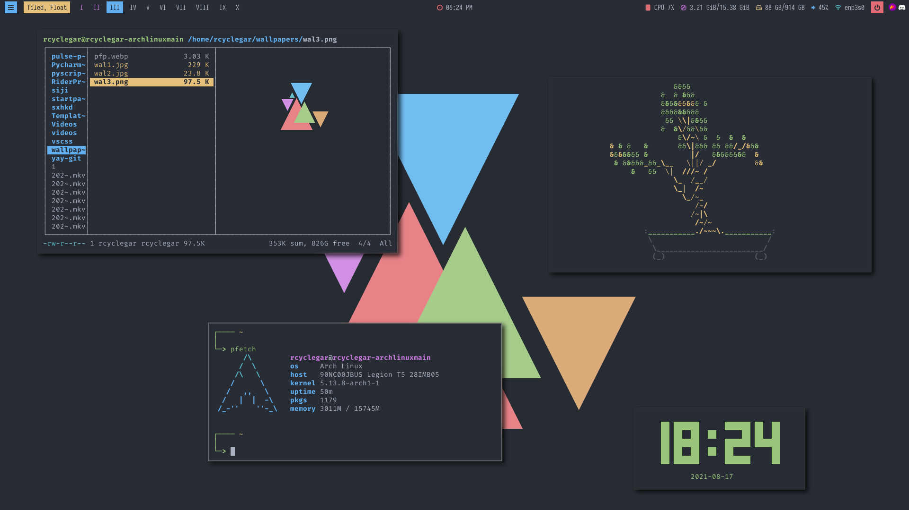
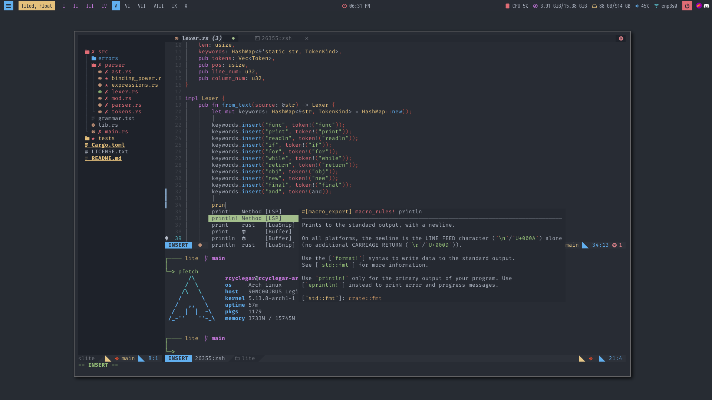
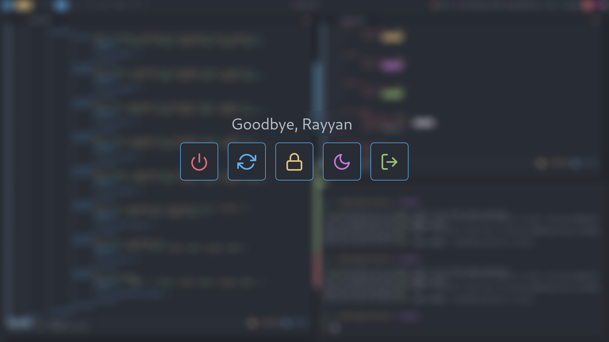
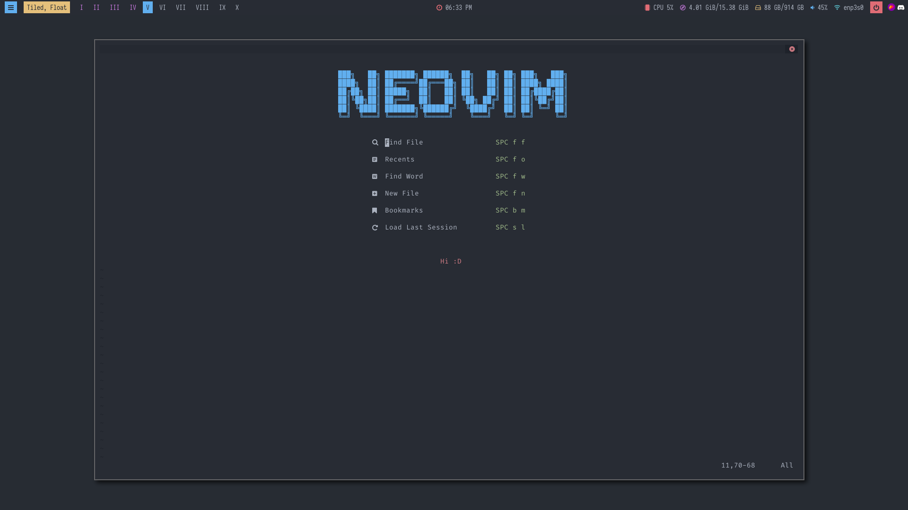

# Hi, welcome to my Dotfiles :D

These are my personal collection of configuration files for my desktop.

### Softwares Used

* WM: BSPWM
* bar: Polybar
* editor: NeoVim
* Widgets: NeoVim
* shortcuts: sxhkd
* shell: ZSH
* terminal: alacritty
* File Manager: Thunar
* Browser: Firefox

## Gallery

